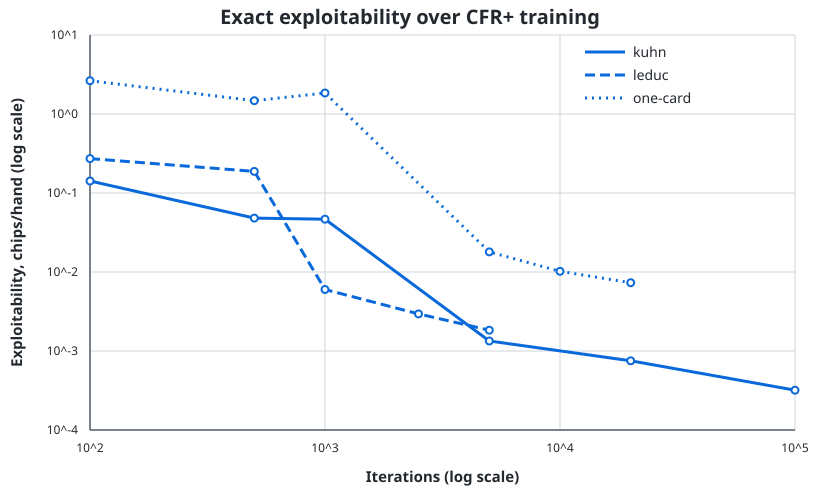

# Solver Results

These results were generated on August 8, 2026 with full-tree CFR+ and evaluated against exact, information-consistent best responses.

## Reading the metrics

For a two-player zero-sum strategy profile \(\sigma\):

- **Profile value** is Player 0's expected chips per hand when both players use \(\sigma\).
- **NashConv** is the sum of how much each player can gain by switching unilaterally to an exact best response.
- **Exploitability** is `NashConv / 2`, the standard two-player zero-sum convention used here.

Lower exploitability is better. A value of zero means the strategy is a Nash equilibrium for the modeled game.

## Summary

| Game | Algorithm | Iterations | Nodes | Information sets | Player 0 value | Exploitability |
|---|---|---:|---:|---:|---:|---:|
| Kuhn Poker | CFR+ | 100,000 | 58 | 12 | -0.055554807 | 0.000319382 |
| Leduc Hold'em | CFR+ | 5,000 | 18,277 | 528 | -0.077676147 | 0.001831778 |
| One-card river, 13 ranks, pot 100, bet 75 | CFR+ | 20,000 | 1,418 | 52 | -3.961780263 | 0.007325113 |



The early non-monotonic points occur during CFR+'s averaging delay. Once averaging begins, exploitability drops rapidly.

## 1. Kuhn Poker

The exact value of Kuhn Poker to Player 0 is

\[
-\frac{1}{18}=-0.055555\ldots
\]

The solver returns `-0.055554807`, an absolute error of about `0.000000748` chips.

### Player 0 opening strategy

| Private card | Check | Bet |
|---|---:|---:|
| J | 75.26% | **24.74%** |
| Q | **100.00%** | 0.00% |
| K | 25.61% | **74.39%** |

This equilibrium uses J as a bluff and K as value. The J betting frequency is approximately one third of the K betting frequency, so the opening betting range contains almost exactly 25% bluffs. For a one-chip bet into a two-chip pot, the theoretical polarized bluff fraction is

\[
\frac{1}{2+2}=25\%.
\]

### Player 1 facing an opening bet

| Private card | Fold | Call |
|---|---:|---:|
| J | **100.00%** | 0.00% |
| Q | 66.40% | **33.60%** |
| K | 0.00% | **100.00%** |

Kuhn has a family of equilibria, so some individual mixed frequencies can differ while preserving the same value and low exploitability. The value/bluff structure and defense frequencies are the important checks.

Full strategy: [`results/kuhn_cfr_plus_100k.json`](results/kuhn_cfr_plus_100k.json)

## 2. One-card river abstraction

Configuration:

- 13 distinct hand-strength ranks;
- pot = 100 chips;
- bet = 75 chips;
- Player 0 acts first;
- higher rank wins at showdown.

### Player 0 opening bet frequency

| Rank | Bet | Rank | Bet |
|---:|---:|---:|---:|
| 1 | 34.68% | 8 | 0.00% |
| 2 | 30.00% | 9 | 7.78% |
| 3 | 35.58% | 10 | 58.10% |
| 4 | 0.52% | 11 | 56.43% |
| 5 | 0.00% | 12 | 56.37% |
| 6 | 0.00% | 13 | 56.38% |
| 7 | 0.00% |  |  |

The strategy is polarized: the weakest ranks bluff, the middle checks, and the strongest ranks bet for value.

The betting mass from ranks 1-4 is **30.01% of the complete betting range**. The game-theory target for a 75-chip bet into 100 is

\[
\text{bluff fraction}=\frac{75}{100+2(75)}=30\%.
\]

This is the clearest end-to-end validation in the project: the engine learns the standard optimal bluff-to-value ratio without being told the formula.

### Player 1 call frequency versus the opening bet

| Rank | Call | Rank | Call |
|---:|---:|---:|---:|
| 1 | 0.00% | 8 | 49.36% |
| 2 | 0.00% | 9 | 89.06% |
| 3 | 0.00% | 10 | 100.00% |
| 4 | 14.06% | 11 | 100.00% |
| 5 | 40.31% | 12 | 100.00% |
| 6 | 44.70% | 13 | 100.00% |
| 7 | 48.34% |  |  |

The transition is mixed rather than a perfectly sharp cutoff because each observed rank removes that rank from the opponent's possible range.

Full strategy: [`results/one_card_13r_pot100_bet75_20k.json`](results/one_card_13r_pot100_bet75_20k.json)

## 3. Leduc Hold'em

Rules used by this implementation:

- deck: J, J, Q, Q, K, K;
- one private card per player;
- one public card between betting rounds;
- one-chip ante from each player;
- bet sizes of 2 before the public card and 4 after it;
- at most two raises after an opening bet;
- Player 0 acts first in both rounds.

### First-round actions

| Spot | J bet | Q bet | K bet |
|---|---:|---:|---:|
| Player 0 opens | 9.59% | 79.15% | 75.41% |
| Player 1 after a check | 32.88% | 85.54% | 99.99% |

J mostly checks, while Q and K bet heavily. The mixes are not strictly monotone because private-card removal, future public cards, and the raise tree all affect continuation value. K also retains checking frequency to protect the check range.

### K public card after first-round check-check

| Player 0 private card | Check | Bet |
|---|---:|---:|
| J | 91.79% | 8.21% |
| Q | 56.47% | 43.53% |
| K | 0.02% | **99.98%** |

The paired K is almost always bet for value. Q mixes substantial thin/value-protection betting, while J supplies a small bluff component.

The complete 528-information-set strategy can be regenerated with `PYTHONPATH=src python scripts/generate_results.py --game leduc`; selected strategically useful frequencies are checked into [`results/key_strategy_frequencies.csv`](results/key_strategy_frequencies.csv).

## Reproduce

```bash
python -m pip install -e ".[dev]"
PYTHONPATH=src python scripts/generate_results.py --game all
```

Machine-readable supporting files:

- [`results/convergence.csv`](results/convergence.csv)
- [`results/key_strategy_frequencies.csv`](results/key_strategy_frequencies.csv)
- per-game convergence CSV files in [`results/`](results/)

## What these results do not claim

These are equilibria of the modeled finite games, not a preflop/flop/turn/river solution for real no-limit Hold'em. A production Hold'em solver must restrict bet sizes, abstract or enumerate card combinations, manage far larger public trees, and generally re-solve subgames. The present benchmarks are intended to make the solver's math, convergence, and exploitability directly auditable.
